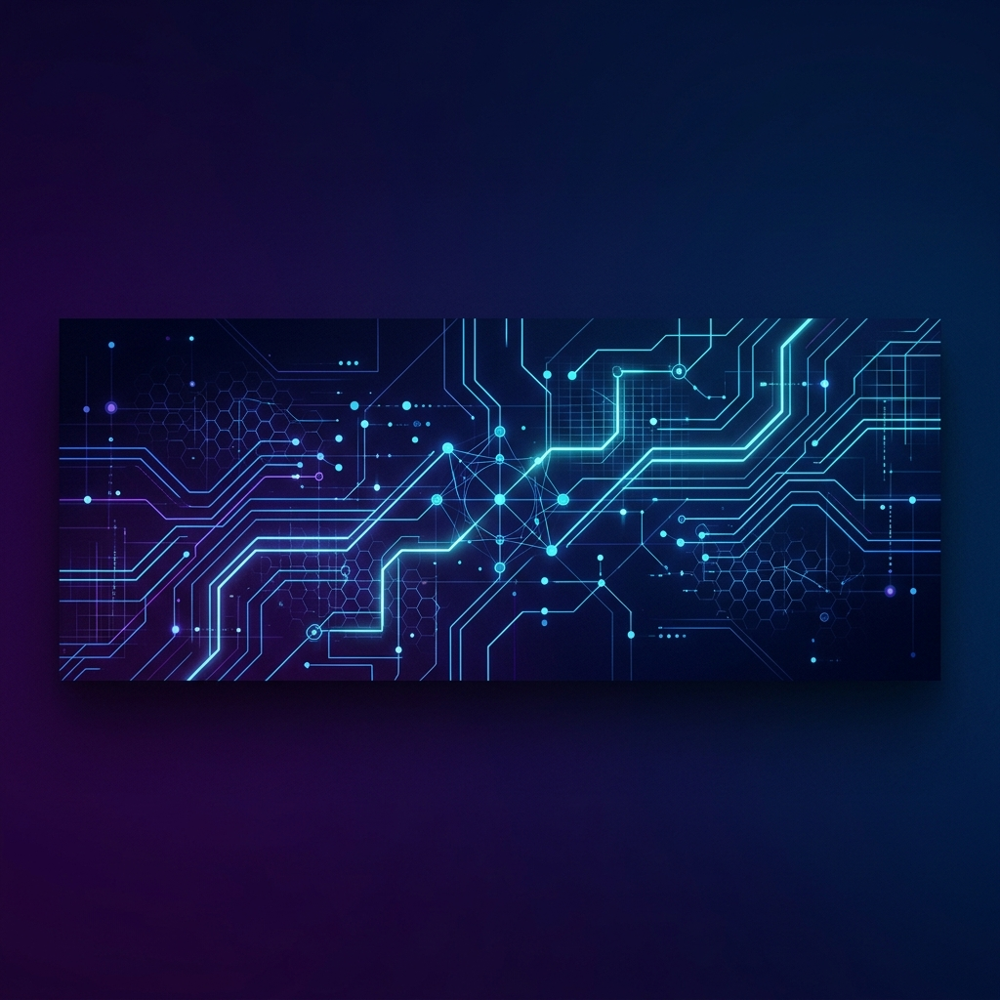

<!-- Sleek Header Banner -->

  

<!-- Typing Intro SVG -->

  

---

### 💫 About Me

I am **Adityaraj Mahalappa Ghodke**, a **Full Stack Developer** and **Software Engineer** passionate about building robust web applications, writing clean code, and solving complex problems. I have experience across system programming (C/C++), application development (Java, Python), and modern web stacks (JavaScript, Node.js, Express.js).

- 🔭 **Current Focus**: Building scalable REST APIs and full-stack web applications.
- ⚡ **Superpowers**: Versatility across multiple languages (C++, Python, Java) and rapid debugging.
- 🌱 **Learning**: Advanced microservices architectures and cloud deployment.
- 💬 **Ask me about**: Full Stack JavaScript development, object-oriented design, and algorithms.

---

### 🛠️ Tech Stack & Toolbox

| Category | Technologies |
| :--- | :--- |
| **Languages** |       |
| **Frameworks & Backend** |    |
| **Tools & Version Control** |   |

---

### 📊 GitHub Stats & Performance

  
  

  

---

### 🏆 GitHub Trophies

  

---

### 📂 Featured Projects

| Project | Tech Stack | Description | Live |
| :--- | :--- | :--- | :---: |
| **[Project One](https://github.com/Adityarajmg17)** | Node.js, Express, JavaScript | Describe your first project here (e.g., A web application or backend API). | [🔗 Repo](https://github.com/Adityarajmg17) |
| **[Project Two](https://github.com/Adityarajmg17)** | Python, C++ | Describe your second project here (e.g., Algorithmic tool, desktop app, or automation script). | [🔗 Repo](https://github.com/Adityarajmg17) |
| **[Project Three](https://github.com/Adityarajmg17)** | Java, REST APIs | Describe your third project here (e.g., Enterprise utility, DB connection service, etc.). | [🔗 Repo](https://github.com/Adityarajmg17) |

---

### 🤝 Connect with Me

  
  

  

